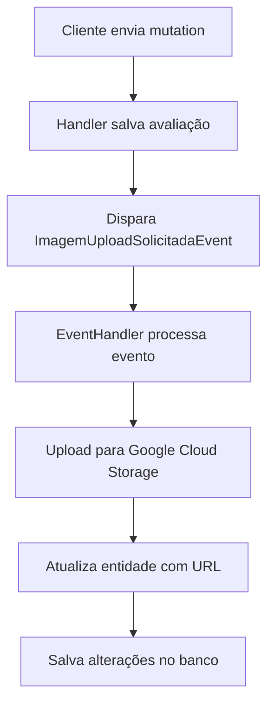

# Avaliação de Úlcera - Exemplos GraphQL

## 📋 Descrição
Esta documentação fornece exemplos de como usar as mutations GraphQL para criar e atualizar avaliações de úlcera, incluindo o gerenciamento de exsudatos e imagens.

## 🔑 Campos Obrigatórios
- `ulceraId`: ID da úlcera
- `profissionalId`: ID do profissional (obrigatório)
- `dataAvaliacao`: Data da avaliação
- `mesesDuracao`: Duração em meses desde o surgimento

## 🔧 Campos Opcionais
- `caracteristicas`: Características da úlcera
- `sinaisInflamatorios`: Sinais inflamatórios
- `medida`: Medidas da úlcera
- `exsudatos`: Lista de IDs de exsudatos
- `imagens`: Lista de arquivos de imagem (base64) + metadados

---

## 🆕 **Criar Nova Avaliação**

### **Exemplo Básico (sem exsudatos/imagens):**
```graphql
mutation CreateAvaliacaoUlcera {
  upsertAvaliacaoUlcera(input: {
    ulceraId: "11111111-1111-1111-1111-111111111111"
    profissionalId: "66666666-6666-6666-6666-666666666666"
    dataAvaliacao: "2024-01-15T10:00:00Z"
    mesesDuracao: 3
    caracteristicas: {
      tecido: "GRANULACAO"
      bordas: "REGULARES"
      profundidade: "SUPERFICIAL"
    }
    sinaisInflamatorios: {
      dor: true
      calor: false
      rubor: true
      edema: false
      perdaFuncao: false
    }
    medida: {
      comprimento: 2.5
      largura: 1.8
      profundidade: 0.5
    }
  }) {
    id
    ulceraId
    profissionalId
    dataAvaliacao
    mesesDuracao
  }
}
```

### **Exemplo Completo (com exsudatos e imagens):**
```graphql
mutation CreateAvaliacaoUlceraCompleta {
  upsertAvaliacaoUlcera(input: {
    ulceraId: "11111111-1111-1111-1111-111111111111"
    profissionalId: "66666666-6666-6666-6666-666666666666"
    dataAvaliacao: "2024-01-15T10:00:00Z"
    mesesDuracao: 3
    caracteristicas: {
      tecido: "GRANULACAO"
      bordas: "REGULARES"
      profundidade: "SUPERFICIAL"
    }
    sinaisInflamatorios: {
      dor: true
      calor: false
      rubor: true
      edema: false
      perdaFuncao: false
    }
    medida: {
      comprimento: 2.5
      largura: 1.8
      profundidade: 0.5
    }
    exsudatos: [
      "22222222-2222-2222-2222-222222222222",
      "33333333-3333-3333-3333-333333333333"
    ]
    imagens: [
      {
        arquivoBase64: "data:image/jpeg;base64,/9j/4AAQSkZJRgABAQAAAQABAAD/2wBDAAYEBQYFBAYGBQYHBwYIChAKCgkJChQODwwQFxQYGBcUFhYaHSUfGhsjHBYWICwgIyYnKSopGR8tMC0oMCUoKSj/2wBDAQcHBwoIChMKChMoGhYaKCgoKCgoKCgoKCgoKCgoKCgoKCgoKCgoKCgoKCgoKCgoKCgoKCgoKCgoKCgoKCgoKCj/wAARCAABAAEDASIAAhEBAxEB/8QAFQABAQAAAAAAAAAAAAAAAAAAAAv/xAAUEAEAAAAAAAAAAAAAAAAAAAAA/8QAFQEBAQAAAAAAAAAAAAAAAAAAAAX/xAAUEQEAAAAAAAAAAAAAAAAAAAAA/9oADAMBAAIRAxEAPwCdABmX/9k="
        descricao: "Foto da ferida - vista frontal"
        dataCaptura: "2024-01-15T10:00:00Z"
      },
      {
        arquivoBase64: "data:image/jpeg;base64,/9j/4AAQSkZJRgABAQAAAQABAAD/2wBDAAYEBQYFBAYGBQYHBwYIChAKCgkJChQODwwQFxQYGBcUFhYaHSUfGhsjHBYWICwgIyYnKSopGR8tMC0oMCUoKSj/2wBDAQcHBwoIChMKChMoGhYaKCgoKCgoKCgoKCgoKCgoKCgoKCgoKCgoKCgoKCgoKCgoKCgoKCgoKCgoKCgoKCgoKCj/wAARCAABAAEDASIAAhEBAxEB/8QAFQABAQAAAAAAAAAAAAAAAAAAAAv/xAAUEAEAAAAAAAAAAAAAAAAAAAAA/8QAFQEBAQAAAAAAAAAAAAAAAAAAAAX/xAAUEQEAAAAAAAAAAAAAAAAAAAAA/9oADAMBAAIRAxEAPwCdABmX/9k="
        descricao: "Foto da ferida - vista lateral"
        dataCaptura: "2024-01-15T10:05:00Z"
      }
    ]
  }) {
    id
    ulceraId
    profissionalId
    dataAvaliacao
    mesesDuracao
  }
}
```

---

## 🔄 **Atualizar Avaliação Existente**

### **Exemplo de Atualização:**
```graphql
mutation UpdateAvaliacaoUlcera {
  upsertAvaliacaoUlcera(input: {
    id: "99999999-9999-9999-9999-999999999999"
    ulceraId: "11111111-1111-1111-1111-111111111111"
    profissionalId: "66666666-6666-6666-6666-666666666666"
    dataAvaliacao: "2024-01-20T14:30:00Z"
    mesesDuracao: 4
    caracteristicas: {
      tecido: "NECROSE"
      bordas: "IRREGULARES"
      profundidade: "PROFUNDA"
    }
    sinaisInflamatorios: {
      dor: false
      calor: true
      rubor: true
      edema: true
      perdaFuncao: true
    }
    medida: {
      comprimento: 3.0
      largura: 2.2
      profundidade: 0.8
    }
    exsudatos: [
      "77777777-7777-7777-7777-777777777777"
    ]
    imagens: [
      "88888888-8888-8888-8888-888888888888"
    ]
  }) {
    id
    ulceraId
    profissionalId
    dataAvaliacao
    mesesDuracao
  }
}
```

---

## 📸 **Gerenciamento de Imagens**

### **Adicionar Imagens:**
```graphql
mutation AdicionarImagensAvaliacao {
  upsertAvaliacaoUlcera(input: {
    id: "99999999-9999-9999-9999-999999999999"
    ulceraId: "11111111-1111-1111-1111-111111111111"
    profissionalId: "66666666-6666-6666-6666-666666666666"
    dataAvaliacao: "2024-01-20T14:30:00Z"
    mesesDuracao: 4
    # ... outros campos existentes ...
    imagens: [
      {
        arquivoBase64: "data:image/jpeg;base64,/9j/4AAQSkZJRgABAQAAAQABAAD/2wBDAAYEBQYFBAYGBQYHBwYIChAKCgkJChQODwwQFxQYGBcUFhYaHSUfGhsjHBYWICwgIyYnKSopGR8tMC0oMCUoKSj/2wBDAQcHBwoIChMKChMoGhYaKCgoKCgoKCgoKCgoKCgoKCgoKCgoKCgoKCgoKCgoKCgoKCgoKCgoKCgoKCgoKCgoKCj/wAARCAABAAEDASIAAhEBAxEB/8QAFQABAQAAAAAAAAAAAAAAAAAAAAv/xAAUEAEAAAAAAAAAAAAAAAAAAAAA/8QAFQEBAQAAAAAAAAAAAAAAAAAAAAX/xAAUEQEAAAAAAAAAAAAAAAAAAAAA/9oADAMBAAIRAxEAPwCdABmX/9k="
        descricao: "Nova foto da evolução da ferida"
        dataCaptura: "2024-01-20T14:30:00Z"
      },
      {
        arquivoBase64: "data:image/jpeg;base64,/9j/4AAQSkZJRgABAQAAAQABAAD/2wBDAAYGBQYHBwYIChAKCgkJChQODwwQFxQYGBcUFhYaHSUfGhsjHBYWICwgIyYnKSopGR8tMC0oMCUoKSj/2wBDAQcHBwoIChMKChMoGhYaKCgoKCgoKCgoKCgoKCgoKCgoKCgoKCgoKCgoKCgoKCgoKCgoKCgoKCgoKCgoKCgoKCj/wAARCAABAAEDASIAAhEBAxEB/8QAFQABAQAAAAAAAAAAAAAAAAAAAAv/xAAUEAEAAAAAAAAAAAAAAAAAAAAA/8QAFQEBAQAAAAAAAAAAAAAAAAAAAAX/xAAUEQEAAAAAAAAAAAAAAAAAAAAA/9oADAMBAAIRAxEAPwCdABmX/9k="
        descricao: "Foto do curativo aplicado"
        dataCaptura: "2024-01-20T14:35:00Z"
      }
    ]
  }) {
    id
  }
}
```

### **Remover Todas as Imagens:**
```graphql
mutation RemoverImagensAvaliacao {
  upsertAvaliacaoUlcera(input: {
    id: "99999999-9999-9999-9999-999999999999"
    ulceraId: "11111111-1111-1111-1111-111111111111"
    profissionalId: "66666666-6666-6666-6666-666666666666"
    dataAvaliacao: "2024-01-20T14:30:00Z"
    mesesDuracao: 4
    # ... outros campos existentes ...
    imagens: [] # Array vazio remove todas as imagens
  }) {
    id
  }
}
```

---

## 💧 **Gerenciamento de Exsudatos**

### **Adicionar Exsudatos:**
```graphql
mutation AdicionarExsudatosAvaliacao {
  upsertAvaliacaoUlcera(input: {
    id: "99999999-9999-9999-9999-999999999999"
    ulceraId: "11111111-1111-1111-1111-111111111111"
    profissionalId: "66666666-6666-6666-6666-666666666666"
    dataAvaliacao: "2024-01-20T14:30:00Z"
    mesesDuracao: 4
    # ... outros campos existentes ...
    exsudatos: [
      "cccc3333-cccc-3333-cccc-333333333333",
      "dddd4444-dddd-4444-dddd-444444444444"
    ]
  }) {
    id
  }
}
```

### **Remover Todos os Exsudatos:**
```graphql
mutation RemoverExsudatosAvaliacao {
  upsertAvaliacaoUlcera(input: {
    id: "99999999-9999-9999-9999-999999999999"
    ulceraId: "11111111-1111-1111-1111-111111111111"
    profissionalId: "66666666-6666-6666-6666-666666666666"
    dataAvaliacao: "2024-01-20T14:30:00Z"
    mesesDuracao: 4
    # ... outros campos existentes ...
    exsudatos: [] # Array vazio remove todos os exsudatos
  }) {
    id
  }
}
```

---

## 🔍 **Consultar Avaliação com Relacionamentos**

```graphql
query GetAvaliacaoUlceraCompleta {
  avaliacaoUlcera(id: "99999999-9999-9999-9999-999999999999") {
    id
    ulceraId
    profissionalId
    dataAvaliacao
    mesesDuracao
    caracteristicas {
      tecido
      bordas
      profundidade
    }
    sinaisInflamatorios {
      dor
      calor
      rubor
      edema
      perdaFuncao
    }
    medida {
      comprimento
      largura
      profundidade
    }
    exsudatos {
      exsudatoId
      exsudato {
        nome
        descricao
      }
    }
    imagens {
      imagem {
        id
        url
        descricao
        dataCaptura
        criadoEm
      }
    }
  }
}
```

---

## 🚀 **Arquitetura de Upload de Imagens**

### **Fluxo Completo:**


### **Vantagens da Abordagem:**
- ✅ **Separação de Responsabilidades**: Upload separado da lógica de negócio
- ✅ **Processamento Assíncrono**: Não bloqueia a resposta da mutation
- ✅ **Escalabilidade**: Múltiplas imagens podem ser processadas em paralelo
- ✅ **Resiliência**: Falhas no upload não afetam a criação da avaliação
- ✅ **Auditoria**: Eventos podem ser logados e monitorados

---

## ⚠️ **Observações Importantes**

### **Comportamento do Upsert:**
- **Exsudatos**: A lista fornecida **substitui completamente** a lista existente
- **Imagens**: A lista fornecida **substitui completamente** a lista existente
- **Array vazio**: Remove todos os relacionamentos
- **Null/undefined**: Mantém os relacionamentos existentes

### **Fluxo de Imagens:**
1. **Upload**: Imagem é enviada no payload (base64)
2. **Salvamento**: Entidade é salva temporariamente sem URL
3. **Evento**: `ImagemUploadSolicitadaEvent` é disparado
4. **Processamento**: Handler faz upload para Google Cloud Storage
5. **Atualização**: URL é atualizada na entidade

### **Validações:**
- Os IDs de exsudatos devem existir no sistema
- O `profissionalId` é obrigatório
- A `ulceraId` deve existir
- Arquivos base64 devem ser válidos

### **Performance:**
- Para grandes quantidades de imagens/exsudatos, considere usar mutations específicas
- O upsert atualiza todos os relacionamentos em uma única operação
- Upload de imagens é processado de forma assíncrona via eventos
